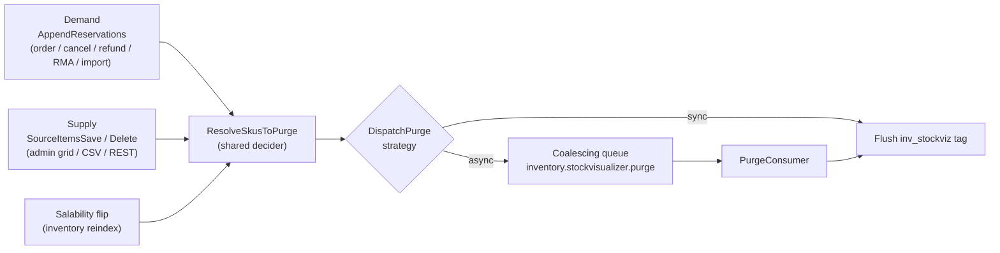

# InventoryStockVisualizer module

The `InventoryStockVisualizer` module renders a storefront **Availability** panel
on the product page, driven by Multi-Source Inventory (MSI). It is **additive**:
it ships as a new `Magento_InventoryStockVisualizer` module and does not replace
or alter any core inventory module.

This module is part of the community MSI distribution. The
[Inventory Management overview](https://developer.adobe.com/commerce/webapi/rest/inventory/index.html)
describes the MSI (Multi-Source Inventory) project in more detail.

## What it shows

The panel is fully configuration-driven under *Stores > Configuration > Catalog >
Inventory > Storefront Stock Visualizer*, and every setting can be overridden
per product through a dedicated *Stock Visualizer* attribute group.

- **Display type** — `level` renders a traffic-light state (high / medium / low /
  out) **server-side inside the cached page, with no AJAX and no quantity
  exposed**; `quantity` renders the exact salable number, fetched over a
  cacheable AJAX fragment.
- **Scope** — `aggregate` shows a single availability for the product; `per_source`
  breaks it down per source. Per-source availability is **source-reservation
  aware**: it nets the physical source quantity against that source's reservation
  balance, and degrades to the physical quantity when source-level reservations
  are off.
- **Delivery mode** (quantity only) — `on_demand` fetches the number on a button
  click; `instant` fetches it on page load. Level display always renders on load.

Availability is computed server-side against the **current website's stock**
(resolved through the sales channel), so one website's cached fragment can never
stand in for another's.

## Configuration

All settings live under `cataloginventory/stock_visualizer`.

| Setting               | Default      | Purpose                                                        |
|-----------------------|--------------|----------------------------------------------------------------|
| `enabled`             | `0`          | Show the panel on the product page.                            |
| `display_type`        | `level`      | `level` (server-rendered semaphore) or `quantity` (AJAX number).|
| `scope`               | `aggregate`  | `aggregate` or `per_source` breakdown.                         |
| `mode`                | `on_demand`  | `on_demand` (fetch on click) or `instant` (fetch on load).     |
| `ttl`                 | `0`          | Public-cache lifetime of the quantity fragment; `0` = tag purge only. |
| `level_basis`         | `quantity`   | Compare the salable qty to absolute thresholds or to a per-product full qty. |
| `level_high`          | `10`         | At or above this the level is high (green).                    |
| `level_low`           | `3`          | At or above this (and below high) the level is medium; below it is low. |
| `show_source_labels`  | `1`          | Show the source name on each per-source row.                   |
| `hide_empty_sources`  | `1`          | Omit out-of-stock sources from the per-source breakdown.       |
| `async_purge`         | `auto`       | Cache-purge strategy: `auto` / `on` / `off` (see below).       |

## Cache invalidation

The panel is cached with the page, so the module keeps it fresh with a
**dedicated cache tag** (`inv_stockviz_<productId>`) that has a small blast
radius — the surrounding product page cache is left untouched. The tag is purged
at three seams, all **best-effort** (failures are swallowed and logged; they
never break checkout or reindex):

- **Demand seam** — an `afterExecute` plugin on `AppendReservationsInterface`
  catches the reservation writes the product's own cache tag misses. It is
  granularity-aware: in level mode it purges only when the level bucket crosses;
  in quantity mode it purges every touched SKU.
- **Supply seam** — plugins on `SourceItemsSaveInterface` /
  `SourceItemsDeleteInterface` snapshot the old per-source quantity and purge on
  quantity changes that never flip salability (which the index-driven backstop
  would miss).
- **Salability backstop** — a salability-change processor in the inventory
  indexer purges on flips that arrive through reindex.
- **Shared decider** — all three seams feed `ResolveSkusToPurge`, which applies
  the enabled gate and the display-mode rules, and `DispatchPurge`, which either
  flushes synchronously or offloads to the queue.
- **Coalescing** — the async path collapses a burst of writes for the same SKU
  into a single purge via a short-lived cache guard, so hot SKUs don't flood the
  queue. The consumer clears the guard first and then flushes live state, so the
  last write wins.

The purge strategy is selected by `async_purge`:

- `auto` (default) — offload to the queue **only when inventory indexing runs on
  schedule**; otherwise flush synchronously.
- `on` — always offload to the queue.
- `off` — always flush synchronously.

The queue path uses a **database-backed** message queue (no RabbitMQ required).

## Operational requirements

- Run `bin/magento setup:upgrade` to register the per-product attributes (data
  patch) and the message-queue topology.
- Run `bin/magento setup:di:compile` for production mode.
- When the purge strategy resolves to the queue, a consumer must be running:
  `bin/magento queue:consumers:start inventory.stockvisualizer.purge` (or via the
  standard consumer cron).

## Extension points and service contracts

Public service contracts live in this module's `Api` namespace:

- `GetStockViewInterface` builds the availability view for a SKU in a stock.
- `Api\Data\StockViewInterface` / `Api\Data\SourceViewInterface` carry the
  aggregate and per-source availability.

The default `GetStockViewInterface` implementation can be swapped through a DI
`preference` to change how availability is computed without touching the panel,
the controller, or the caching layer.
