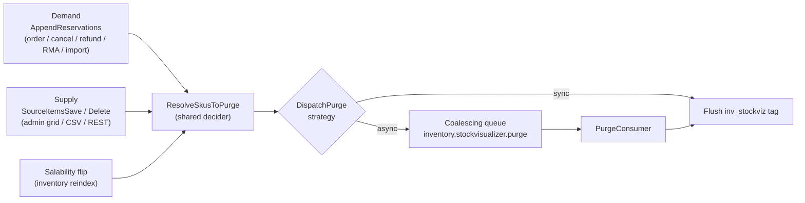

# InventoryStockVisualizer module

The `InventoryStockVisualizer` module renders a storefront **Availability** panel
on the product page, driven by Multi-Source Inventory (MSI). It is **additive**:
it ships as a new `Magento_InventoryStockVisualizer` module and does not replace
or alter any core inventory module.

This module is part of the community MSI distribution. The
[Inventory Management overview](https://developer.adobe.com/commerce/webapi/rest/inventory/index.html)
describes the MSI (Multi-Source Inventory) project in more detail.

## What it shows

The panel is configuration-driven under *Stores > Configuration > Catalog >
Inventory > Storefront Stock Visualizer*. The general settings sit at the top
level; two subsections group the rest — **Per-source breakdown** (single-SKU
scope options) and **Composite product types** (per-type display modes). The
display type and the level thresholds can be overridden per product through a
dedicated *Stock Visualizer* attribute group.

- **Display type** — `level` renders a traffic-light state (high / medium / low /
  out) with **no exact quantity exposed**; `quantity` renders the exact salable
  number. Display type is **coarse across every product type**: in level mode no
  type ever reveals a number, while the per-type mode below still defines the
  *structure* (aggregate, per-component, or selected variant). Level per-component
  rows render a colour-coded availability bar instead of a count.
- **Scope** (single-SKU) — `aggregate` shows a single availability; `per_source`
  breaks it down per source. Applies to simple / virtual / downloadable products
  and to the **selected configurable variant**; composite aggregate and
  per-component displays are always aggregated. Per-source availability is
  **source-reservation aware**: it nets the physical source quantity against that
  source's reservation balance, and degrades to the physical quantity when
  source-level reservations are off.
- **Delivery mode** — for availability fetched over AJAX (exact quantity, and the
  interactive composite types), `on_demand` fetches on a button click and
  `instant` fetches on page load. Server-rendered availability always shows on
  load.

Availability is computed server-side against the **current website's stock**
(resolved through the sales channel), so one website's cached fragment can never
stand in for another's.

## Composite product types

Simple, virtual and downloadable products use the single-SKU quantity/level path
above. Each composite type has its own display mode (store-scoped), because a
`GetProductSalableQtyInterface` read is undefined for a type that does not manage
its own stock — the module reads the aggregate salable status and the child
breakdown through the type-aware inventory services instead.

| Type          | Modes (default first)            | Interactive?  | What it shows                                                                 |
|---------------|----------------------------------|---------------|-------------------------------------------------------------------------------|
| Configurable  | `variant` · `children` · `status`| `variant` yes | `variant`: the selected option combination's availability (with per-source when enabled); `children`: every variant's availability; `status`: one in-stock / out-of-stock word. |
| Bundle        | `max` · `children` · `status`    | `max` yes     | `max`: how many of the current selection can be ordered, recomputed as options and quantities change; `children`: each selection's stock; `status`: aggregate word. |
| Grouped       | `children` · `status`            | no            | `children`: each associated product's stock, plus an optional **complete-sets calculator** (how many full sets can be assembled); `status`: aggregate word. |

- The interactive modes read the live selection from the **native** storefront
  widgets — the swatch/dropdown configurable resolves the chosen child, and the
  bundle reads the `priceBundle` option config — so the panel never reconstructs a
  selection from the DOM. The client sends the child product id (never a SKU); the
  server resolves it.
- **Native badge de-duplication** — the module removes the core availability
  badges for simple, virtual, grouped, configurable, bundle and downloadable
  products, so the panel never sits next to a duplicate or contradictory core
  stock badge. Options, swatches and links (rendered by separate blocks) are left
  untouched.

## Configuration

All settings live under `cataloginventory/stock_visualizer`.

| Setting                             | Default     | Purpose                                                        |
|-------------------------------------|-------------|----------------------------------------------------------------|
| `enabled`                           | `0`         | Show the panel on the product page.                            |
| `display_type`                      | `level`     | `level` (semaphore) or `quantity` (exact number). Coarse across all types. |
| `mode`                              | `on_demand` | `on_demand` (fetch on click) or `instant` (fetch on load) for AJAX availability. |
| `ttl`                               | `0`         | Public-cache lifetime of the AJAX fragments; `0` = tag purge only. |
| `level_basis`                       | `quantity`  | Compare the salable qty to absolute thresholds or to a per-product full qty. |
| `level_high`                        | `10`        | At or above this the level is high (green).                    |
| `level_low`                         | `3`         | At or above this (and below high) the level is medium; below it is low. |
| `scope`                             | `aggregate` | Single-SKU breakdown: `aggregate` or `per_source`.            |
| `show_source_labels`                | `1`         | Show the source name on each per-source row.                   |
| `hide_empty_sources`                | `1`         | Omit out-of-stock sources from the per-source breakdown.       |
| `composite_configurable_mode`       | `variant`   | Configurable display: `variant` / `children` / `status`.       |
| `composite_bundle_mode`             | `max`       | Bundle display: `max` / `children` / `status`.                 |
| `composite_grouped_mode`            | `children`  | Grouped display: `children` / `status`.                        |
| `composite_grouped_sets_calculator` | `0`         | Show the complete-sets calculator (grouped `children` only).   |

Per-product overrides (attribute group *Stock Visualizer*) cover the display type
and the level thresholds: `stockviz_display_type`, `stockviz_level_basis`,
`stockviz_level_high`, `stockviz_level_low`, `stockviz_full_qty` (the percentage
reference). Scope, delivery mode and the composite modes are store-scoped only.

## Cache invalidation

The panel is cached with the page, so the module keeps it fresh with a
**dedicated cache tag** (`inv_stockviz_<productId>`) that has a small blast
radius — the surrounding product page cache is left untouched. The tag is purged
at three seams, all **best-effort** (failures are swallowed and logged; they
never break checkout or reindex):

- **Demand seam** — an `afterExecute` plugin on `AppendReservationsInterface`
  catches the reservation writes the product's own cache tag misses. It is
  granularity-aware: in level mode it purges only when the level bucket crosses;
  in quantity mode it purges every touched SKU.
- **Supply seam** — plugins on `SourceItemsSaveInterface` /
  `SourceItemsDeleteInterface` snapshot the old per-source quantity and purge on
  quantity changes that never flip salability (which the index-driven backstop
  would miss).
- **Salability backstop** — a salability-change processor in the inventory
  indexer purges on flips that arrive through reindex.
- **Shared decider** — all three seams feed `ResolveSkusToPurge`, which applies
  the enabled gate and the display-mode rules, and `DispatchPurge`, which either
  flushes synchronously or offloads to the queue.
- **Coalescing** — the async path collapses a burst of writes for the same SKU
  into a single purge via a short-lived cache guard, so hot SKUs don't flood the
  queue. The consumer clears the guard first and then flushes live state, so the
  last write wins.

The purge strategy **follows the inventory indexer automatically** — there is no
separate setting to keep in sync. When the *Inventory* index runs **on schedule**,
purges offload to the queue; when it runs **on save (realtime)**, purges flush
synchronously. The queue path uses a **database-backed** message queue (no
RabbitMQ required).

### Configuration changes show immediately

Tag purges track stock changes, not configuration changes, and the AJAX fragments
are publicly cacheable. To keep a settings change from being masked by a cached
fragment, every fragment request carries a short **config fingerprint** (`_cv`)
derived from the display settings (`Config::getVersion()`). Changing any display
setting mints a fresh cache key, so the new output is served on the next load
without a manual cache flush.

## Operational requirements

- Run `bin/magento setup:upgrade` to register the per-product attributes (data
  patch) and the message-queue topology.
- Run `bin/magento setup:di:compile` for production mode.
- When the purge strategy resolves to the queue, a consumer must be running:
  `bin/magento queue:consumers:start inventory.stockvisualizer.purge` (or via the
  standard consumer cron).

## Extension points and service contracts

Public service contracts live in this module's `Api` namespace:

- `GetStockViewInterface` builds the availability view for a SKU in a stock,
  optionally typed so composite products resolve their aggregate and child
  breakdown instead of an (undefined) direct salable quantity.
- `Api\Data\StockViewInterface` / `Api\Data\SourceViewInterface` carry the
  aggregate and per-source availability; `Api\Data\ChildViewInterface` carries one
  composite child's label and availability.

The AJAX fragments are served by controllers under the `inventory_stockviz`
front-name — `product/view` (single SKU or configurable variant), `product/children`
(composite child breakdown and the grouped sets calculator) and `product/bundleMax`
(sellable count for a bundle selection). Composite reads go through the
`Model\Availability` services (`GetCompositeChildren`, `GetGroupedSetsMax`,
`GetBundleMaxSellable`), each independently testable.

The default `GetStockViewInterface` implementation can be swapped through a DI
`preference` to change how availability is computed without touching the panel,
the controller, or the caching layer.
