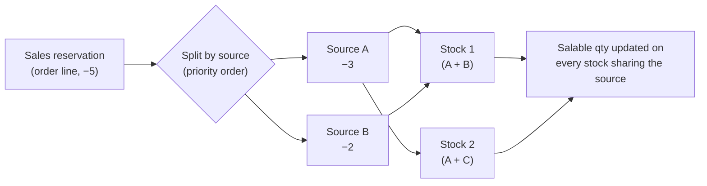
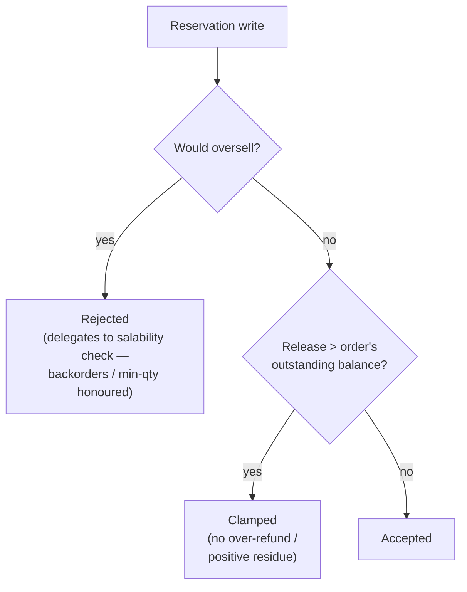
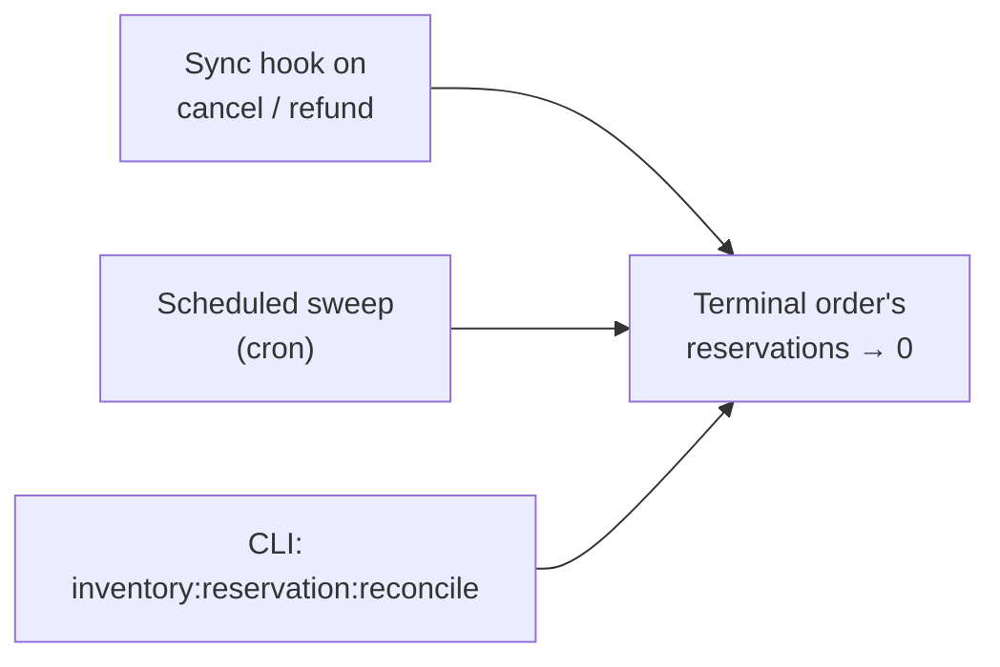
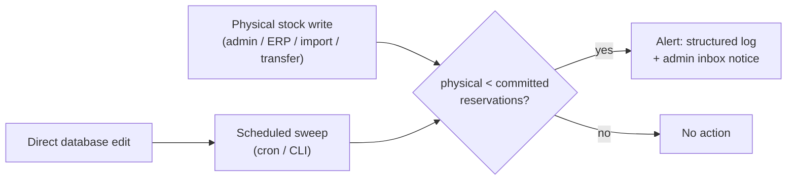

# jeanmarcos/inventory

Community distribution of Magento **Multi-Source Inventory (MSI)** with curated
community fixes shipped ahead of Adobe's upstream release cadence, redistributed
under **AFL-3.0**.

It is a **drop-in replacement** for the open-source MSI modules: it keeps the
original `Magento_Inventory*` module names and `Magento\Inventory*` namespaces,
so no application code changes are required.

> Derived from [magento/inventory](https://github.com/magento/inventory)
> (Copyright Adobe). Not affiliated with or endorsed by Adobe.

## Compatibility

| Platform                    | Supported line   | How it resolves |
|-----------------------------|------------------|-----------------|
| Magento Open Source 2.4.9   | `2.4.9.*`        | replaces `magento/module-inventory-*` |
| Magento Open Source 2.4.8   | `2.4.8.*`        | replaces `magento/module-inventory-*` |
| Magento Open Source 2.4.7   | `2.4.7.*`        | replaces `magento/module-inventory-*` |
| **Mage-OS 3** (2.4.9 base)  | `2.4.9.*` (≥ `2.4.9.12`) | also replaces `mage-os/module-inventory-*` |

On **Mage-OS 3** the same `2.4.9.*` build is used with **no project-level
changes**. Mage-OS republishes the inventory modules under the `mage-os/` vendor,
so this package replaces both the `magento/module-inventory-*` and the
`mage-os/module-inventory-*` names — whichever the platform installs, this
distribution provides the code. The `magento/framework` requirement resolves
because `mage-os/framework` declares `replace: {"magento/framework": "103.0.9"}`,
so the framework gate still selects the 2.4.9 build.

## Exclusive features

Three opt-in capabilities layered on top of upstream MSI. All are **off by
default** and are configured under *Stores > Configuration > Catalog >
Inventory*.

| Feature                                  | 2.4.9      | 2.4.8      | 2.4.7      |
|------------------------------------------|------------|------------|------------|
| Source-level reservations                | `2.4.9.6`  | `2.4.8.8`  | `2.4.7.7`  |
| Reservation integrity & reconciliation   | `2.4.9.10` | `2.4.8.12` | `2.4.7.11` |
| Supply-side oversell detection           | `2.4.9.11` | `2.4.8.13` | `2.4.7.12` |

### Source-level reservations

Splits each sales reservation into one row **per source**, allocated across the
stock's enabled sources in priority order — so salable quantity stays correct
across every stock that shares a source.



- **Cross-stock accuracy** — salable quantity is updated on *every* stock that
  shares a source, closing the cross-stock oversell gap.
- **Compensations follow the demand** — shipment, cancellation and credit-memo
  compensations land on the sources the demand was originally allocated to, even
  when the shipment ships from a different source.
- **Toggling** the setting requires a full inventory reindex.
- **2.4.7 caveat** — the SKU-list reservations reader does not exist upstream on
  the 2.4.7 line, so the feature covers the single-SKU read path only.

| Setting                                        | Default |
|------------------------------------------------|---------|
| `cataloginventory/source_reservations/enabled` | off     |

### Reservation integrity guards & reconciliation

The reservation ledger enforces its own invariants **at write time**, and an
opt-in reconciliation pass heals orders whose release was never written.



**Write-time guards** (always enforced once installed):

- **No over-release** — a compensation can never release more than the order's
  outstanding balance, so over-refunds and positive residue can't inflate
  salable quantity.
- **No oversell** — a reservation that would oversell is rejected, delegating the
  decision to the standard salability check so backorders and min-qty are
  honoured.

**Reconciliation** (opt-in) brings a terminal order's reservations back to zero
without ever over-releasing — recovering from a failed or bypassed observer, a
third-party state change, or a direct database edit.



| Setting                                                        | Default        |
|----------------------------------------------------------------|----------------|
| `cataloginventory/source_reservations/reconcile_cancel_refund` | off            |
| `cataloginventory/source_reservations/reconcile_sweep_enabled` | off            |
| `cataloginventory/source_reservations/reconcile_sweep_cron`    | `0 * * * *`    |

### Supply-side oversell detection

The write-time guards defend the demand side; this defends the supply side.
When physical stock is lowered below the reservations already committed against a
source — an admin edit, an ERP push, a bulk transfer, or a direct database edit —
the position becomes silently oversold. Detection **never blocks the change**
(physical stock stays authoritative); it surfaces the oversold position for
reconciliation.



- **Real-time** — every physical-quantity write path is checked as it happens;
  the write always succeeds.
- **Vector-agnostic sweep** — a CLI (`inventory:reservation:detect-oversell`) and
  an opt-in cron scan all sources regardless of how the quantity dropped, so even
  direct database edits are caught.

| Setting                                                          | Default     |
|------------------------------------------------------------------|-------------|
| `cataloginventory/source_reservations/oversell_detection_enabled`| off         |
| `cataloginventory/source_reservations/oversell_sweep_enabled`    | off         |
| `cataloginventory/source_reservations/oversell_sweep_cron`       | `0 * * * *` |

## Installation

```bash
composer require "jeanmarcos/inventory:2.4.9.*"
```

Pick the constraint that matches your Magento line:

| Magento line | Constraint  | `magento/framework`      |
|--------------|-------------|--------------------------|
| 2.4.7        | `2.4.7.*`   | `>=103.0.7 <103.0.8`     |
| 2.4.8        | `2.4.8.*`   | `>=103.0.8 <103.0.9`     |
| 2.4.9        | `2.4.9.*`   | `>=103.0.9 <103.0.10`    |

Each release pins `magento/framework` to a single Magento line, so Composer
automatically selects the build matching your installation.

On **Mage-OS 3** use the same `2.4.9.*` constraint — no extra configuration. From
`2.4.9.12` onward this package also replaces the `mage-os/module-inventory-*`
modules, so earlier project-level `replace` workarounds are no longer needed and
can be removed.

If you install from the Git repository directly instead of Packagist, add it as
a VCS repository first:

```json
{
    "repositories": [
        { "type": "vcs", "url": "https://github.com/jeanmarcos-dev/inventory" }
    ]
}
```

## Versioning

Releases are tagged `2.4.<line>.<n>`, where `<line>` mirrors the Magento minor
line and `<n>` is this distribution's release counter (independent of Adobe's
`-pN` patch naming).

## Branches

- `dist-2.4.7`, `dist-2.4.8`, `dist-2.4.9` — the per-line distributions
  (packaging plus curated fixes). Releases are tagged here.
- `develop` — untouched mirror of upstream `magento/inventory`.

## License

Redistributed under [AFL-3.0](https://opensource.org/licenses/AFL-3.0). The
original Adobe/Magento copyright headers are retained in every source file.
